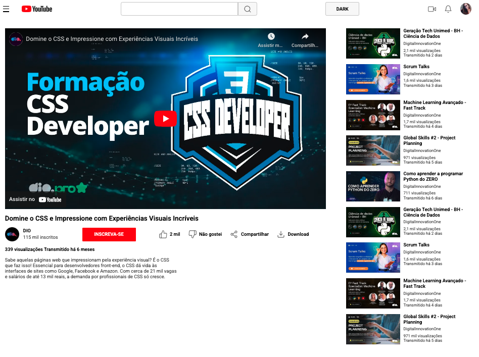
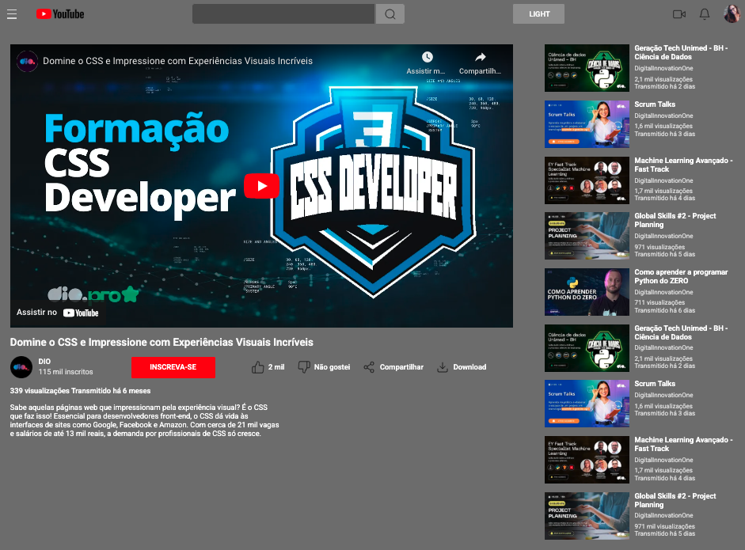

## Desafio: Clonando a Página do Youtube com CSS
- Desafio proposto pela instrutora Michele Ambrosio como parte da formação de CSS da Dio.
- Desafio respondido por Alisson Rangel.

## Adições ao desafio:
- Usei um iframe do Youtube para o vídeo principal do layout;
- Criei o modo dark e o modo light;
- Acrescentei um botão que alterna entre o modo dark e o modo light com o uso de javascript.

## Modo Light

## Modo Dark
